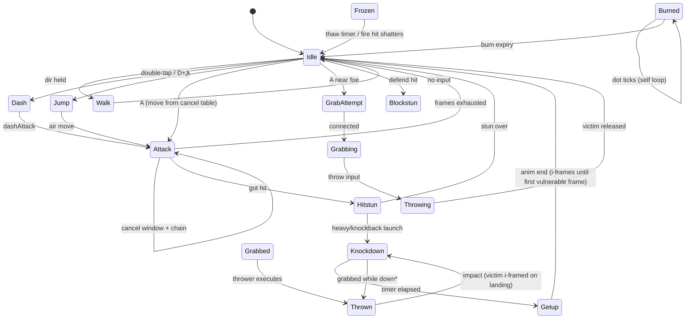

# Section 2 — Simulation Core


The simulation lives in `src/sim/` as pure, deterministic TypeScript: `stepWorld(state: WorldState, inputs: InputFrame[]): WorldState` advances exactly one tick at 60 Hz. No `Date.now()`, no `Math.random`, no DOM access — the render layer in `src/render/` only reads snapshots.

### 2.1 Frame-Data Interfaces (`src/sim/types.ts`)

All gameplay content is data; the engine interprets sheets, never hardcodes character logic (mirrors LF2 `.dat` files).

```ts
interface CharacterSheet {
  id: string;
  maxHp: number; maxMp: number; mpRegenPerTick: number;
  walkSpeed: number; runSpeed: number; jumpImpulse: number;
  moves: Record<string, MoveDef>;        // "punch1", "dashAttack", "specialFire", ...
  grabMoveId?: string;
}

interface MoveFrame {
  sprite: string;                        // atlas key
  durationTicks: number;
  vx: number; vy: number; vz: number;    // velocity applied during this frame
  hitbox?: HitboxDef;                    // active attack box
  hurtbox?: HitboxDef;                   // optional per-frame override
  mpCost?: number;                       // charged once on move start
  cancelInto?: string[];                 // chain targets allowed from this frame
  nextFrameLink?: { moveId: string; frameIndex: number }; // auto-chain (e.g. punch1→punch2)
  spawnProjectile?: ProjectileSpawn;
}

interface HitboxDef {
  x: number; y: number; z: number;       // center offset from fighter origin
  w: number; h: number; d: number;       // extents (d = z-depth plane)
  damage: number;
  knockback: { vx: number; vy: number; vz?: number };
  hitstunTicks: number;
  type: 'light' | 'heavy' | 'projectile' | 'grab';
  priority: number;                      // tiebreaker for simultaneous hits
}
```

Frame indexing is absolute per move: `frameIndex` counts ticks since move start; a move's total length is the sum of its frames' `durationTicks`.

### 2.2 Fighter State Machine



I-frame rules: `Knockdown` and `Getup` set `invulnUntilTick`; all hit checks reject targets with `tick < invulnUntilTick`. Landing from `Thrown` grants short ground i-frames so juggle loops terminate.

### 2.3 Physics Constants (`src/sim/constants.ts`)

| Constant | Value | Unit |
|---|---|---|
| TICK_RATE | 60 | ticks/s |
| GRAVITY | 0.35 | px/tick² |
| GROUND_FRICTION | 0.80 | multiplicative/tick |
| AIR_DRAG | 0.96 | multiplicative/tick |
| WALK_SPEED | 2.2 | px/tick |
| RUN_DASH_SPEED | 5.0 | px/tick |
| JUMP_IMPULSE | -8.5 | px/tick (vy) |
| KNOCKDOWN_LAUNCH_VY | -6.0 | px/tick |
| ARENA_W × ARENA_H × ARENA_D | 1600 × 480 × 120 | px (nominal) |
| WALL_BOUNCE_RESTITUTION | 0.4 | — |
| MAX_FIGHTERS | 8 | — |

Arena is a bounded box; x clamps to `[0, 1600]` with bounce, z (depth) clamps to the 120px band for pseudo-3D sorting.

### 2.4 Hit Detection Pipeline (per tick, ordered)

1. For each attacker in `Attacking` state whose current frame has an active `hitbox`: build world-space AABB.
2. Broad-phase vs candidate hurtboxes (x/y/z interval overlap).
3. Priority tiebreak: higher `priority` wins mutual trades; equal priority → lower entity id attacks first (deterministic).
4. I-frame check: skip if `target.invulnUntilTick > tick`.
5. Resolve: apply damage → MP/hitstun → knockback vector scaled by target facing; set state `Hitstun` or `Knockdown` if `knockback.vy < LAUNCH_THRESHOLD`.
6. Combo counter increments when new hit lands before `comboResetTicks`; reset otherwise.

Each hitbox stores `hitIds: Set<entityId>` so one swing hits each victim once.

### 2.5 Seeded RNG

`src/sim/rng.ts` exports mulberry32:

```ts
export function mulberry32(seed: number): () => number {
  return function () {
    seed |= 0; seed = (seed + 0x6D2B79F5) | 0;
    let t = Math.imul(seed ^ (seed >>> 15), 1 | seed);
    t = (t + Math.imul(t ^ (t >>> 7), 61 | t)) ^ t;
    return ((t ^ (t >>> 14)) >>> 0) / 4294967296;
  };
}
```

`WorldState.seed` seeds it; item drops and CPU jitter consume draws in fixed order each tick so replay hashes stay stable.

### 2.6 Input Buffer & Sequence Matcher

`InputFrame` = `{ a: boolean; j: boolean; dHeld: boolean; dir: Dir }`. Inputs push into a per-fighter ring buffer of 12 entries (`src/sim/inputBuffer.ts`); moves consume buffered presses within their startup windows.

Specials match directional strings against recent buffer history: patterns like `'D>A'`, `'DD>A'`, `'D^J'` compile to token sequences checked after each new press, newest-first. Each matched special carries `mpCost`; the matcher rejects activation when `mp < cost`, leaving the buffer intact for cheaper chains.
