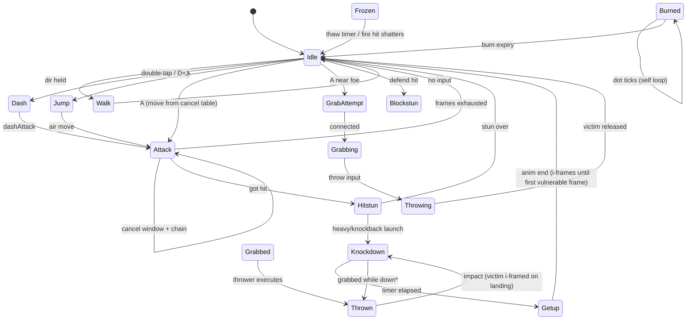

# LF2 Web — Design Specification

> Browser remake of Little Fighter 2 (Marti Wong & Starsky Wong, 2000) — VS-mode core. Scope tier: **Core LF2 feel** (user-locked): VS Mode with 6 original archetypes, 2 stages, up to 4 local humans + CPU bots, deterministic sim, TypeScript + Canvas2D + Vite + Bun, free/CC0 art only.

## Table of Contents
1. [Architecture](#section-1--architecture)
2. [Simulation Core](#section-2--simulation-core)
3. [Content Pipeline](#section-3--content-pipeline)
4. [Presentation, UX & Testing](#section-4--presentation-ux-testing)
5. [Out of Scope / Future Phases](#out-of-scope--future-phases)

---

# Section 1 — Architecture

Single-page TypeScript app: one `<canvas>` battlefield, a thin DOM overlay for menus/HUD chrome, and a deterministic simulation at the center. Per locked decision 6, the sim exposes `stepWorld(state, inputs[]) -> state'`, never hardcodes character behavior, and treats all gameplay content as interpreted data.

## Folder Layout

```
lf2-web/
├── index.html                 # canvas element + #ui overlay root, loads src/main.ts
├── package.json               # Bun-managed deps and scripts
├── tsconfig.json
├── vite.config.ts
├── public/
│   └── assets/                # sprite atlases (PNG), fonts, audio files — served verbatim
└── src/
    ├── sim/                   # PURE deterministic simulation (no DOM, no clocks)
    │   ├── types.ts           # WorldState, Fighter, Projectile, InputFrame, SimEvent
    │   ├── world.ts           # stepWorld(), spawnMatch()
    │   ├── fighter.ts         # per-fighter FSM advance
    │   ├── physics.ts         # gravity, friction, arena bounds
    │   ├── hitdetect.ts       # AABB overlap + hit-resolution pipeline
    │   ├── specials.ts        # directional-sequence matcher over buffered inputs
    │   ├── bot.ts             # CPU botThink(): utility scorer -> InputFrame (pure)
    │   └── rng.ts             # seeded PRNG (mulberry32 — §2.5)
    ├── content/               # JSON sheets -> validated, sim-ready structures
    │   ├── loader.ts          # fetch, parse, validate against schema, cache
    │   └── schema.ts          # runtime validators mirroring CharacterSheet/StageDef
    ├── data/                  # ALL gameplay data (versioned, human-editable)
    │   ├── characters/        # brawler.json, swordsman.json, fire-caster.json, ...
    │   ├── stages/            # grassland-dojo.json, rooftop-night.json
    │   ├── weapons.json
    │   └── items.json
    ├── input/                 # devices -> per-slot InputFrame snapshots
    │   ├── keyboard.ts        # P1/P2 default key maps
    │   ├── gamepad.ts         # Standard Gamepad mapping, up to 4 pads
    │   └── router.ts          # merges devices into slots[0..3] (+ CPU slots flagged bot)
    ├── render/                # Canvas2D; READS WorldState, never mutates it
    │   ├── renderer.ts        # clear, depth-sort, blit sprites, draw HUD bars
    │   ├── atlas.ts           # atlas lookup: (sheet, frameId) -> source rect
    │   └── camera.ts          # fixed whole-arena framing, integer pixel snapping
    ├── audio/                 # WebAudio graph; plays SFX/music keyed on SimEvents
    │   └── audio.ts
    └── ui/                    # DOM overlay: menus, character select, pause, results
        ├── scene-manager.ts
        └── scenes/            # title.ts, mode.ts, select.ts, stage-select.ts, battle.ts, results.ts
```

## Separation Boundaries

- **sim/** is pure: equal `(state, inputs)` sequences produce identical states on every machine. Imports only its own modules; emits `SimEvent[]` (hit landed, weapon broke, KO) for presentation.
- **content/** depends inward on `sim/types.ts` only: converts raw JSON into frozen structures the sim interprets. The sim never fetches.
- **input/** knows the `InputFrame` shape (attack/jump/defend + direction bits, per tick), nothing about moves or characters.
- **render/, audio/, ui/** are consumers: they read state/events and perform side effects; none may mutate `WorldState`.

## Fixed-Timestep Game Loop (60 Hz accumulator)

`main.ts` runs the only clock in the app (`performance.now()` is legal *here* alone):

```ts
const TICK_MS = 1000 / 60;
let acc = 0, prev = performance.now();
function frame(now: number): void {
  acc += Math.min(now - prev, 250);      // clamp tab-switch stalls: no fast-forward spirals
  prev = now;
  while (acc >= TICK_MS) {
    const inputs: InputFrame[] = inputRouter.poll();  // one snapshot per slot, this tick
    const { state, events } = stepWorld(world, inputs);
    world = state;
    events.forEach((e) => { audio.onEvent(e); hud.onEvent(e); });
    acc -= TICK_MS;
  }
  renderer.draw(world, acc / TICK_MS);   // alpha reserved for future interpolation
  requestAnimationFrame(frame);
}
```

Sim advances only whole ticks per rAF; rendering happens once per frame. Replays reduce to logging `(seed, roster, stage, inputs[])`.

## Scene Management

`SceneManager` (in `ui/scene-manager.ts`) holds the active scene; each scene implements `enter(ctx)`, `exit()`, `update(dtMs)`, `draw()`:

| Scene | Responsibility | Transitions |
|---|---|---|
| `title` | logo, start, controls help | → mode |
| `mode` | free-for-all vs 2 teams, slot config (humans join, CPU fills) | → select |
| `select` | 6-char roster, per-slot human/CPU/team | → stage-select |
| `stage-select` | Grassland Dojo / Rooftop Night, seed display | → battle |
| `battle` | builds `WorldState`, runs match timer, win check | → results; ⇄ pause |
| `pause` | overlay; freezes sim stepping, keeps last frame | resume → battle; quit → title |
| `results` | winner banner, rematch / roster / quit | → battle, select, title |

Only `battle` steps the sim; `pause` stops feeding ticks while remaining mounted (state untouched).

## Toolchain Configuration

Bun manages installs and tests; Vite handles dev/build. `package.json` scripts:

```json
{
  "scripts": {
    "dev": "vite",
    "build": "tsc --noEmit && vite build",
    "preview": "vite preview",
    "typecheck": "tsc --noEmit",
    "test": "bun test"
  },
  "devDependencies": ["typescript", "vite"],
  "engines": { "bun": ">=1.1" }
}
```

`tsconfig.json` essentials: `"target": "ES2022"`, `"module": "ESNext"`, `"moduleResolution": "bundler"`, `"strict": true`, plus `noUncheckedIndexedAccess`, `exactOptionalPropertyTypes`, `noImplicitOverride`, `verbatimModuleSyntax`, `isolatedModules`. `vite.config.ts`: `base: "./"` so the bundle runs from any static host, plus path aliases (`@sim/*`, `@render/*`, `@content/*`) mirroring the folders.

## Determinism Guarantees

1. No `Math.random`, `Date.now`, or `performance.now` under `src/sim/`; all randomness flows through the seeded `rng.ts` instance carried inside `WorldState`.
2. Fighters live in a fixed slot array `[0..7]`; update and collision passes iterate slots ascending — no object-key iteration order.
3. Sim math is IEEE-754 doubles in fixed operation order; identical engines reproduce it bit-for-bit, keeping rollback netcode and golden replay tests viable.
4. Content sheets load before `spawnMatch()` and are frozen, so async loads never interleave with ticks.


## Module Dependency Rules
1. `sim/` imports nothing from `render/`, `input/`, `ui/`, `audio/`, or `content/`; no DOM or Bun APIs — pure TS only.
2. Dependencies point inward: `content → sim/types`, `render → sim/state` (read-only), `input → sim/types` (InputFrame); `audio` reacts to SimEvents via callback.
3. `ui/` may use `render/` and `input/`, but invokes `stepWorld` only through battle-scene loop hooks in `main.ts`.
4. `main.ts` is the sole cross-layer composition point; no import cycles.


---

# Section 2 — Simulation Core


The simulation lives in `src/sim/` as pure, deterministic TypeScript: `stepWorld(state: WorldState, inputs: InputFrame[]): WorldState` advances exactly one tick at 60 Hz. No `Date.now()`, no `Math.random`, no DOM access — the render layer in `src/render/` only reads snapshots.

### 2.1 Frame-Data Interfaces (`src/sim/types.ts`)

All gameplay content is data; the engine interprets sheets, never hardcodes character logic (mirrors LF2 `.dat` files).

```ts
interface CharacterSheet {
  id: string;
  maxHp: number; maxMp: number; mpRegenPerTick: number;
  walkSpeed: number; runSpeed: number; jumpImpulse: number;
  moves: Record<string, MoveDef>;        // "punch1", "dashAttack", "specialFire", ...
  grabMoveId?: string;
}

interface MoveFrame {
  sprite: string;                        // atlas key
  durationTicks: number;
  vx: number; vy: number; vz: number;    // velocity applied during this frame
  hitbox?: HitboxDef;                    // active attack box
  hurtbox?: HitboxDef;                   // optional per-frame override
  mpCost?: number;                       // charged once on move start
  cancelInto?: string[];                 // chain targets allowed from this frame
  nextFrameLink?: { moveId: string; frameIndex: number }; // auto-chain (e.g. punch1→punch2)
  spawnProjectile?: ProjectileSpawn;
}

interface HitboxDef {
  x: number; y: number; z: number;       // center offset from fighter origin
  w: number; h: number; d: number;       // extents (d = z-depth plane)
  damage: number;
  knockback: { vx: number; vy: number; vz?: number };
  hitstunTicks: number;
  type: 'light' | 'heavy' | 'projectile' | 'grab';
  priority: number;                      // tiebreaker for simultaneous hits
}
```

Frame indexing is absolute per move: `frameIndex` counts ticks since move start; a move's total length is the sum of its frames' `durationTicks`.

### 2.2 Fighter State Machine



I-frame rules: `Knockdown` and `Getup` set `invulnUntilTick`; all hit checks reject targets with `tick < invulnUntilTick`. Landing from `Thrown` grants short ground i-frames so juggle loops terminate.

### 2.3 Physics Constants (`src/sim/constants.ts`)

| Constant | Value | Unit |
|---|---|---|
| TICK_RATE | 60 | ticks/s |
| GRAVITY | 0.35 | px/tick² |
| GROUND_FRICTION | 0.80 | multiplicative/tick |
| AIR_DRAG | 0.96 | multiplicative/tick |
| WALK_SPEED | 2.2 | px/tick |
| RUN_DASH_SPEED | 5.0 | px/tick |
| JUMP_IMPULSE | -8.5 | px/tick (vy) |
| KNOCKDOWN_LAUNCH_VY | -6.0 | px/tick |
| ARENA_W × ARENA_H × ARENA_D | 1600 × 480 × 120 | px (nominal) |
| WALL_BOUNCE_RESTITUTION | 0.4 | — |
| MAX_FIGHTERS | 8 | — |

Arena is a bounded box; x clamps to `[0, 1600]` with bounce, z (depth) clamps to the 120px band for pseudo-3D sorting.

### 2.4 Hit Detection Pipeline (per tick, ordered)

1. For each attacker in `Attacking` state whose current frame has an active `hitbox`: build world-space AABB.
2. Broad-phase vs candidate hurtboxes (x/y/z interval overlap).
3. Priority tiebreak: higher `priority` wins mutual trades; equal priority → lower entity id attacks first (deterministic).
4. I-frame check: skip if `target.invulnUntilTick > tick`.
5. Resolve: apply damage → MP/hitstun → knockback vector scaled by target facing; set state `Hitstun` or `Knockdown` if `knockback.vy < LAUNCH_THRESHOLD`.
6. Combo counter increments when new hit lands before `comboResetTicks`; reset otherwise.

Each hitbox stores `hitIds: Set<entityId>` so one swing hits each victim once.

### 2.5 Seeded RNG

`src/sim/rng.ts` exports mulberry32:

```ts
export function mulberry32(seed: number): () => number {
  return function () {
    seed |= 0; seed = (seed + 0x6D2B79F5) | 0;
    let t = Math.imul(seed ^ (seed >>> 15), 1 | seed);
    t = (t + Math.imul(t ^ (t >>> 7), 61 | t)) ^ t;
    return ((t ^ (t >>> 14)) >>> 0) / 4294967296;
  };
}
```

`WorldState.seed` seeds it; item drops and CPU jitter consume draws in fixed order each tick so replay hashes stay stable.

### 2.6 Input Buffer & Sequence Matcher

`InputFrame` = `{ a: boolean; j: boolean; dHeld: boolean; dir: Dir }`. Inputs push into a per-fighter ring buffer of 12 entries (`src/sim/inputBuffer.ts`); moves consume buffered presses within their startup windows.

Specials match directional strings against recent buffer history: patterns like `'D>A'`, `'DD>A'`, `'D^J'` compile to token sequences checked after each new press, newest-first. Each matched special carries `mpCost`; the matcher rejects activation when `mp < cost`, leaving the buffer intact for cheaper chains.


---

# Section 3 — Content Pipeline

All gameplay content is plain JSON under `src/data/`, fetched and validated once by `src/content/loader.ts` before `spawnMatch()` runs. Sheets contain literal numbers only — no computed or random values. Every stochastic decision (sky-drop rolls, bot jitter) draws from the sim's seeded RNG (§2.5) in fixed order, so replay hashes stay stable regardless of content or load timing.

## 3.1 Data layout

```
src/data/
├── characters/            # one sheet per archetype
│   ├── brawler.json       # embeds its own projectile defs (mirrors LF2 .dat)
│   └── …
├── stages/
│   ├── grassland-dojo.json
│   └── rooftop-night.json
├── weapons.json           # knife, baseball-bat, boulder, box
└── items.json             # milk, beer
```

Two small extensions to §2.1, owned here: `MoveDef = { frames: MoveFrame[]; sequence?: string }` — `sequence` feeds the §2.6 matcher (`"D>A"`); and `CharacterSheet.roles: Record<string,string>` maps generic FSM slots (e.g. `dashAttack`) to move ids. Projectiles resolve sheet-locally: `spawnProjectile.projectileId` indexes `sheet.projectiles`.

## 3.2 Worked example — `characters/brawler.json`

```json
{
  "id": "brawler",
  "maxHp": 240, "maxMp": 100, "mpRegenPerTick": 0.05,
  "walkSpeed": 2.2, "runSpeed": 5.0, "jumpImpulse": -8.5,
  "grabMoveId": "grappleSlam",
  "roles": { "dashAttack": "flyingKnee" },
  "moves": {
    "punch1": { "frames": [
      { "sprite": "br_p1_windup", "durationTicks": 3, "vx": 0.6, "vy": 0, "vz": 0 },
      { "sprite": "br_p1_active", "durationTicks": 4, "vx": 1.4, "vy": 0, "vz": 0,
        "cancelInto": ["punch2"],
        "hitbox": { "x": 26, "y": -34, "z": 0, "w": 30, "h": 18, "d": 44,
          "damage": 8, "knockback": { "vx": 1.5, "vy": 0 }, "hitstunTicks": 14,
          "type": "light", "priority": 10 } },
      { "sprite": "br_p1_recover", "durationTicks": 5, "vx": 0, "vy": 0, "vz": 0,
        "cancelInto": ["punch2"] } ] },
    "punch2": { "frames": [
      { "sprite": "br_p2_windup", "durationTicks": 3, "vx": 0.6, "vy": 0, "vz": 0 },
      { "sprite": "br_p2_active", "durationTicks": 4, "vx": 1.8, "vy": 0, "vz": 0,
        "cancelInto": ["punch3"],
        "hitbox": { "x": 27, "y": -34, "z": 0, "w": 32, "h": 18, "d": 44,
          "damage": 10, "knockback": { "vx": 2.0, "vy": 0 }, "hitstunTicks": 16,
          "type": "light", "priority": 10 } },
      { "sprite": "br_p2_recover", "durationTicks": 6, "vx": 0, "vy": 0, "vz": 0,
        "cancelInto": ["punch3"] } ] },
    "punch3": { "frames": [
      { "sprite": "br_p3_windup", "durationTicks": 5, "vx": 0.4, "vy": 0, "vz": 0 },
      { "sprite": "br_p3_active", "durationTicks": 4, "vx": 2.2, "vy": 0, "vz": 0,
        "hitbox": { "x": 28, "y": -36, "z": 0, "w": 34, "h": 24, "d": 44,
          "damage": 16, "knockback": { "vx": 3.5, "vy": -6.0 }, "hitstunTicks": 24,
          "type": "heavy", "priority": 12 } },
      { "sprite": "br_p3_recover", "durationTicks": 9, "vx": 0, "vy": 0, "vz": 0 } ] },
    "flyingKnee": { "frames": [
      { "sprite": "br_knee_crouch", "durationTicks": 2, "vx": 3.0, "vy": 0, "vz": 0 },
      { "sprite": "br_knee_active", "durationTicks": 8, "vx": 5.0, "vy": 0, "vz": 0,
        "hitbox": { "x": 24, "y": -38, "z": 0, "w": 30, "h": 22, "d": 44,
          "damage": 18, "knockback": { "vx": 3.0, "vy": -6.0 }, "hitstunTicks": 30,
          "type": "heavy", "priority": 20 } },
      { "sprite": "br_knee_land", "durationTicks": 6, "vx": 0, "vy": 0, "vz": 0 } ] },
    "energyBlast": { "sequence": "D>A", "frames": [
      { "sprite": "br_blast_windup", "durationTicks": 6, "vx": 0, "vy": 0, "vz": 0, "mpCost": 25 },
      { "sprite": "br_blast_cast", "durationTicks": 4, "vx": 0, "vy": 0, "vz": 0,
        "spawnProjectile": { "projectileId": "energyShot", "offsetX": 28, "offsetY": -36 } },
      { "sprite": "br_blast_recover", "durationTicks": 8, "vx": 0, "vy": 0, "vz": 0 } ] },
    "grappleSlam": { "frames": [
      { "sprite": "br_grab_reach", "durationTicks": 3, "vx": 1.2, "vy": 0, "vz": 0 },
      { "sprite": "br_grab_hold", "durationTicks": 4, "vx": 0, "vy": 0, "vz": 0,
        "hitbox": { "x": 18, "y": -36, "z": 0, "w": 22, "h": 30, "d": 40,
          "damage": 0, "knockback": { "vx": 0, "vy": 0 }, "hitstunTicks": 0,
          "type": "grab", "priority": 25 } },
      { "sprite": "br_grab_slam", "durationTicks": 10, "vx": 0, "vy": 0, "vz": 0 } ] }
  },
  "projectiles": {
    "energyShot": { "sprite": "fx_energy_shot", "size": { "w": 24, "h": 14, "d": 14 },
      "velocityVx": 7.0, "gravity": 0, "ttlTicks": 130, "pierce": false,
      "damage": 15, "knockback": { "vx": 3.0, "vy": -1.0 }, "hitstunTicks": 18,
      "type": "projectile", "priority": 15 }
  }
}
```

Frame indexing is absolute per move (ticks since move start). `punch1` spans ticks 0–11; its hitbox is live ticks 3–6, and `cancelInto: ["punch2"]` opens the chain window there — Attack pressed during ticks 3–11 reroutes into `punch2` (ticks 0–12), then `punch3`. `punch3` launches at `vy: -6.0` (`KNOCKDOWN_LAUNCH_VY`, §2.3), forcing Knockdown. `flyingKnee` is the dash attack: 16 ticks at `RUN_DASH_SPEED` with the same guaranteed launch. `energyBlast` charges 25 MP once at move start (§2.1), spawns `energyShot` at tick 6, and recovers through tick 17; the shot flies straight (`gravity: 0`, 910 px range), hits once, despawns on wall or TTL.

## 3.3 Weapons — `weapons.json`

```json
{
  "knife":        { "kind": "thrown", "meleeDamage": 12, "throwDamage": 28, "throwVy": -4.0, "durability": 3, "breakOnThrowImpact": true,  "carrierSpeedMul": 1.0,  "repickupDelayTicks": 20 },
  "baseball-bat": { "kind": "melee",  "meleeDamage": 26, "throwDamage": 14, "throwVy": -3.0, "durability": 8, "breakOnThrowImpact": false, "carrierSpeedMul": 0.95, "repickupDelayTicks": 20 },
  "boulder":      { "kind": "heavy",  "meleeDamage": 34, "throwDamage": 45, "throwVy": -7.0, "durability": 1, "breakOnThrowImpact": true,  "carrierSpeedMul": 0.55, "repickupDelayTicks": 60 },
  "box":          { "kind": "heavy",  "meleeDamage": 18, "throwDamage": 22, "throwVy": -5.0, "durability": 2, "breakOnThrowImpact": true,  "carrierSpeedMul": 0.75, "repickupDelayTicks": 30 }
}
```

Durability decrements per landed melee swing; at 0 the weapon emits a `weaponBreak` SimEvent and despawns. Throwing always expends the held instance; `breakOnThrowImpact` destroys it on first fighter/wall contact, otherwise it drops as a pickup. `carrierSpeedMul` scales walk/run while held (boulder = crawl); `repickupDelayTicks` blocks instant re-grab after a drop.

## 3.4 Items — `items.json`

```json
{
  "milk": { "effect": "healHp",    "amount": 90, "consumeTicks": 30, "shelfLifeTicks": 1200 },
  "beer": { "effect": "restoreMp", "amount": 60, "consumeTicks": 30, "shelfLifeTicks": 1200 }
}
```

Consuming locks the drink animation for `consumeTicks`; the effect applies on completion and is cancelled if the drinker takes a hit mid-animation. Untouched items despawn after `shelfLifeTicks`.

## 3.5 Stages — `stages/*.json`

```json
{
  "id": "grassland-dojo",
  "bounds": { "w": 1600, "h": 480, "d": 120 },
  "walls": { "left": 0, "right": 1600, "restitution": 0.4 },
  "layers": [
    { "atlasKey": "bg_dojo_sky",   "parallax": 0.15, "baselineY": 96 },
    { "atlasKey": "bg_dojo_hills", "parallax": 0.4,  "baselineY": 208 },
    { "atlasKey": "bg_dojo_floor", "parallax": 1.0,  "baselineY": 420 }
  ],
  "drops": {
    "firstDropTick": 600, "intervalTicks": 900, "intervalJitterTicks": 180,
    "table": { "milk": 3, "beer": 3, "knife": 2, "baseball-bat": 2, "boulder": 1, "box": 2 }
  }
}
```

`bounds` must sit within the 1600×480×120 nominal arena (§2.3); `walls` override restitution per side. Layers composite back-to-front; with the fixed whole-arena camera, fractional parallax only shifts during screenshake. Sky-drop cadence: first crate at tick 600, then every `intervalTicks ± jitter` (drawn from the seeded RNG, never stored in JSON). Each drop performs exactly three ordered RNG draws — weighted table pick, x ∈ `[80, w−80]`, z ∈ depth band — so any seed replays identically. `rooftop-night.json` shortens cadence (`intervalTicks: 720`) and skews hardware: `{"milk":2,"beer":2,"knife":3,"baseball-bat":3,"boulder":1,"box":4}`.

## 3.6 Art sourcing & atlas conventions

All art from Kenney (kenney.nl), **CC0 1.0 Universal** — public-domain dedication, no attribution required, commercial use permitted:

| Need | Kenney pack |
|---|---|
| Fighter poses (≤64px, side view) | Tiny Dungeon |
| Weapon/item icons | Roguelike/RPG pack |
| Blast/hit FX | Particle Pack |
| Stage tiles & backdrops | Pixel Platformer |

Locked decision 4 stands: no ripped LF2 sprites or portraits. We still keep `public/assets/CREDITS.txt` listing pack URLs for provenance. Atlases are per-category twins in `public/assets/atlas/`: `fighters`, `props`, `fx`, `bg` — each `*.png` + `*.json`. PNGs are power-of-two canvases (512²–1024², RGBA); JSON is a frame array `{name, x, y, w, h, pivotX, pivotY}` where `name` matches `MoveFrame.sprite` verbatim. Frames get a 1px transparent gutter, are packed at native pixel size (never smoothly resampled), and sample nearest-neighbor (`imageSmoothingEnabled = false`, CSS `pixelated`, §4). Fighter pivots sit at feet-center for z-sorting by ground point (§1 renderer).

## 3.7 Load-time validation

Hand-rolled validators in `src/content/schema.ts` — zero dependencies, closed objects, exact pointers; zod was rejected because its default-loose object shapes would hide the typo/nondeterminism classes we must catch. Shape:

```ts
export interface FieldError { file: string; pointer: string; message: string }
// pointer e.g. "moves.punch3.frames[1].hitbox.damage"
export function validateCharacterSheet(raw: unknown, file: string): FieldError[]
```

`loader.ts` pipeline: `Promise.all` fetch → parse (a `SyntaxError` becomes a file-level `FieldError`) → `validate*` per kind → cross-link pass → deep `Object.freeze` → typed cache. Errors accumulate across **all** files, then one `ContentLoadError` reports every violation (`file :: pointer — message`); the battle scene refuses to construct `WorldState` until the report is empty, halting boot before Title (error overlay, §4). Cross-link checks: `cancelInto`/`nextFrameLink`/`roles` reference declared moves; `spawnProjectile.projectileId` exists in `sheet.projectiles`; drop-table ids exist in `weapons ∪ items`; all velocities finite; melee/heavy durability ≥ 1. Closed schemas reject undeclared keys everywhere, which structurally enforces "no random fields" in content.


---

# Section 4 — Presentation, UX & Testing

## Screen flow

Scene graph lives in `src/ui/scene-manager.ts` (stack machine; transitions are a 150 ms fade). Flow: **Title → Mode → Character Select → Stage Select → Battle → Results**, with Pause as an overlay, not a scene.

1. **Title**: logo, blinking "press attack"; menu items VS Mode / Controls / About.
2. **Mode Select**: Free-for-all or 2 Teams; slot config — 1–4 humans join, remaining of 8 fighter slots filled with CPU bots; duplicate character picks allowed (LF2 style).
3. **Character Select**: 6-portrait grid. A pad presses Attack to join; a colored chip (`P1`–`P4`) docks onto its portrait. Each joined slot cycles **team** (Independent / Red / Blue) with Defend, confirms with Jump. Empty slots show a bot icon with auto-assigned archetype.
4. **Stage Select**: two cards — Grassland Dojo, Rooftop Night — with thumbnail previews; Attack confirms.
5. **Battle**: HUD below; Esc/Start opens the Pause overlay (Resume / Remap / Quit to Menu).
6. **Results**: winner banner (team color) or per-fighter standings sorted by K/D; buttons Rematch / Character Select / Menu.

## HUD

Per fighter, drawn in `src/render/renderer.ts` (HUD pass): red HP bar and blue MP bar (MP regenerates slowly, per brief), 24×24 portrait, name plate, and a **team-colored ring** under the sprite (gray when Independent). Stock count renders only when stocks > 1 (default: off). Bars sit along the top edge, mirrored for right-half fighters; up to 8 fighters stay legible via 2-row layout.

## Input & control defaults

`src/input/router.ts` normalizes keyboard (`event.code`), Gamepad API (standard mapping), and user remaps into one `InputFrame` per slot, consumed by `stepWorld`. Defaults (Attack/Jump/Defend order):

| Slot | Move | Attack / Jump / Defend |
|---|---|---|
| P1 | Arrows | `,` / `.` / `/` |
| P2 | WASD | `F` / `G` / `H` |
| P3 | IJKL | `;` / `,` / `/` |
| P4 | Numpad 8/4/5/6 | `Numpad0` / `Numpad.` / `Numpad+` |

Gamepad (standard mapping): left stick + dpad (buttons 12–15) move; X (2) attack, A (0) jump, B (1) defend; Start (9) pause. Hot-plug handled via `gamepadconnected/disconnected`. P3's default `,`/`/` overlap P1's trio on ANSI layouts; the router ships a documented fallback (P3 Jump `'`, Defend `Enter`) applied when P1 and P3 both join. The **remap UI** (Options screen, reachable from Title and Pause) captures raw keys per action, flags duplicate bindings, persists to `localStorage['lf2.bindings.v1']`.

## Canvas scaling

Internal logical resolution **960×540** (16:9, fits the whole-arena fixed camera and 8 depth-sorted sprites). Backing store stays 960×540; CSS size is integer-scaled: `scale = Math.max(1, Math.floor(Math.min(vw/960, vh/540)))`, centered in a black letterbox container, `image-rendering: pixelated`, `ctx.imageSmoothingEnabled = false`. Resize/orientation events recompute scale only. On integer-DPR displays the backing store may be multiplied by DPR for crispness; fractional DPR falls back to CSS upscale.

## WebAudio plan

`src/audio/audio.ts` wraps one `AudioContext` created **suspended** and resumed on the first pointer/key gesture (autoplay policy); all fetch→`decodeAudioData` work happens lazily after that gesture. Bank: ~15 SFX (`hit_light`, `hit_heavy`, `whiff`, `block`, `jump`, `land`, `dash`, `grab`, `ko`, `weapon_pickup`, `weapon_break`, `item_drop`, `cast_fire`, `cast_ice`, `menu_move`/`menu_confirm`) plus 2 music loops (one per stage) through looping `AudioBufferSourceNode`s. Master/Music/Sfx `GainNode` chain; `M` toggles mute, persisted to `localStorage['lf2.muted']`.

## CPU bot AI

`src/sim/bot.ts` exports pure `botThink(state, self, rng): InputFrame`, called inside the fixed step against a dedicated RNG channel, so replays stay deterministic. A utility scorer ranks candidate actions (approach, retreat, attack-chain, dash-attack, special, dodge, grab, idle):

- **Distance bands** to nearest enemy: < 48 px → attack chains; 48–160 px → approach or dash-attack; > 160 px → approach, or ranged special when MP ≥ cost + reserve floor.
- **Projectile dodge**: scan entities for hostile projectiles whose straight-line extrapolation of current velocity crosses the self hitbox soon; if so, dodge (jump or Defend) outscores everything.
- **Thresholds**: HP < 25 % raises retreat weight; Support mage heals the lowest-HP teammate instead when safe. Team modes target nearest enemy only.
- **Cooldown ticks**: after committing, decisions lock for 12 ticks except emergency dodges — prevents jitter.

No lookahead: only current-frame sheet data is evaluated.

## Testing strategy

Vitest-style suites run with `bun test`. (1) **Hit-resolution units** load fixture sheets from `tests/fixtures/*.json` and assert damage, knockback vectors, i-frames, and blockstun across active-window overlaps and priority clashes. (2) **Golden replay**: a checked-in script `{seed, stage, roster, frames}` feeds the headless runner in `src/main.ts` behind a `HEADLESS=1` env flag; the runner hashes canonical final-state JSON (sha256) and compares against the golden file — any sim nondeterminism fails CI. (3) **Input-mapper tests**: synthetic `KeyboardEvent`s and fake gamepad snapshots produce expected `InputFrame`s, including remap persistence and the P3 fallback.

## Failure handling

Missing/corrupt data file (sheet JSON fails parse or schema validation at boot): full-screen **error overlay** naming the exact file and reason, with Reload; boot halts before Title. Art load failure: magenta placeholder box (`#FF00FF`) sized to the tile's declared frame box, logged warning, battle continues. Audio failure (404/decode error): silent continue — the engine marks the sound unavailable and never throws into the game loop.


---

## Out of Scope / Future Phases

Deferred by locked decisions (not v1 deliverables, architecture leaves them cheap to add):
- Online netplay — determinism + input-log replays are in place; rollback/delay-based transport is a later phase.
- Stage Mode (wave/boss progression), Survival Stage, 1v1 & 2v2 Championship brackets, Battle Mode variants.
- Full 24-character roster, secret unlock codes, gameplay recorder UI.
- Mobile/touch controls.
