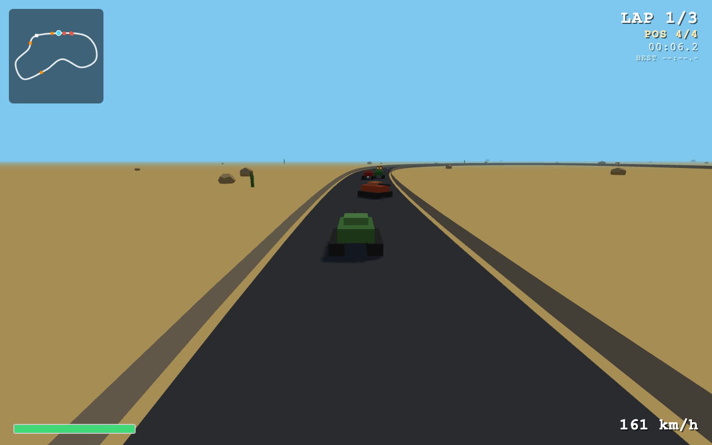

# TANK RACER

A 3D tank racing game for the browser — a homage to *Tank Racer* (1997). Race
three AI tanks over three laps of a closed circuit — pick from **DUST BOWL**
(desert), **CANYON RUN** (mesa country) or **GLACIER LOOP** (an icy,
extra-wide circuit with slippery ice patches): blast rivals with your cannon,
dodge incoming shells, grab power-up crates, and hit the boost pads on the
straights. Low-poly PS1-era look, pure client-side TypeScript + Three.js, no
assets (all audio is synthesized with WebAudio oscillators).



## Controls

| Key            | Action              |
| -------------- | ------------------- |
| `W` / `↑`      | Accelerate          |
| `S` / `↓`      | Brake / reverse     |
| `A` `D` / `←` `→` | Steer            |
| `Space`        | Fire shell          |
| `Enter`        | Start race (title)  |
| `R`            | Restart (results; also while paused) |
| `P` / `Esc`    | Pause / resume (race) |
| `M`            | Mute / unmute       |
| `C`            | Toggle 1 PLAYER / 2 PLAYERS (title) |

### 2-Player split-screen

Press `C` on the title screen (or `Y` on a gamepad) to switch to **2 PLAYERS**.
The mode is remembered in localStorage. In 2P the screen splits into two halves,
each with its own chase camera and color-coded HUD (P1 cyan, P2 orange), plus
one shared minimap highlighting both players:

| Player | Drive            | Fire  |
| ------ | ---------------- | ----- |
| **P1** | `W` `A` `S` `D`  | Space |
| **P2** | Arrow keys       | Enter |

In 2P the arrow keys drive P2 exclusively — they no longer steer P1. The grid
stays at four tanks: P1, P2, then two AI. Results wait until both players have
finished and highlight both rows; each human finisher is eligible for best-time
records. Touch devices and gamepad users are 1P-only: trying to enable 2P while
touch controls or a gamepad are active shows a toast instead.

### Gamepad (standard mapping)

Connects automatically on any button press ("🎮 CONNECTED" toast); keyboard
and touch still work — last input wins each frame.

| Pad input                  | Action                                   |
| -------------------------- | ---------------------------------------- |
| Left stick X               | Steer (deadzone 0.15, curved response)   |
| A (bottom) or RT           | Accelerate                               |
| B (right) or LT            | Brake / reverse                          |
| X (left) or RB             | Fire shell                               |
| Start                      | Pause / resume                           |
| D-pad / left stick         | Cycle track (◀ ▶) and tank (▲ ▼) on menus |
| A (bottom)                 | Confirm (= Enter / R)                    |
| Y (top)                    | Toggle 1P / 2P mode (title)              |

## Tracks

- **DUST BOWL** — the original desert circuit: long straight, twin hairpins.
- **CANYON RUN** — mesa slabs and cholla fields; big sweepers plus a chicane.
- **GLACIER LOOP** — snow banks under an ice-blue sky, ~16u-wide road built
  for sliding, and three pale-blue **ice patches**: while you're on one,
  lateral grip drops to ×0.35 and acceleration to ×0.6, so ease off before
  the sweepers. The AI reads local grip and slows down too.

Cycle tracks with `←`/`→`, tanks with `↑`/`↓` on the title screen; best lap
and total times are saved per track in localStorage.

## Pause

Press `P` or `Esc` during a race to freeze the entire simulation — physics,
timers, lap logic, AI, shells and power-up respawn clocks all stop, and all
audio suspends. The same key resumes exactly where you left off; `R` while
paused restarts the race.

## Touch controls

On touch devices (detected via `pointer: coarse` or the first touch), overlay
buttons appear during the countdown and race:

- **Auto-throttle** is always on — no accelerate button needed
- **◀ ▶** buttons (lower-left) steer; multi-touch safe, so you can steer and fire together
- **FIRE** button (lower-right) shoots one shell per press

Title/results screens are tappable (tap = Enter/R equivalent). Desktop keyboard
flow is completely unchanged.

Boost pads on the track give an automatic speed burst. Power-up crates grant a
random pickup: Speed Boost (auto), Shield (absorbs one hit), or Triple-Shot
(next 3 trigger pulls fire a spread).

## Run it

Requires [bun](https://bun.sh).

```sh
bun install     # install dependencies
bun run dev     # dev server with HMR
bun run build   # typecheck + production build into dist/
```

## Project layout

- `src/game.ts` — state machine (`title → countdown → race → results`),
  orchestration, chase/title cameras, camera juice
- `src/track.ts` — spline-defined circuit, road/walls mesh, boost pads, lap
  + checkpoint logic
- `src/spline.ts` — pure Catmull-Rom closed-loop math (point/tangent/closest)
- `src/tank.ts` — tank mesh factory + shared arcade driving physics
- `src/player.ts` — keyboard → tank input mapping
- `src/ai.ts` — spline-following driver brains with rubber-banding and firing
- `src/weapons.ts` — shells, hits, spin-outs, wrecks + respawns
- `src/powerups.ts` — crates, pickups, shield bubbles
- `src/hud.ts` — DOM HUD (speed, health, power-up slot, lap/pos/time, minimap)
- `src/screens.ts` — title / countdown / banner / results overlays
- `src/audio.ts` — WebAudio oscillator SFX + engine hum (created on first key
  press to satisfy autoplay policies), plus a procedural music loop and
  pause/resume via AudioContext suspension
- `src/juice.ts` — cheap particle juice: drift dust, impact sparks, wreck bursts

## scripts/sim-ai.ts

A headless sanity harness for the AI (no rendering): runs the three driver
brains against real tank physics on a real circuit (including ice-patch grip)
and prints finish times, per-lap splits, and wall-contact stats.

```sh
bun scripts/sim-ai.ts               # all tracks
bun scripts/sim-ai.ts glacier-loop  # one track
```

## Deploy (GitHub Pages)

The game is plain static output, so it deploys straight to GitHub Pages.
Because it lives in a subdirectory of the repo, builds are **subpath-aware**:
set `BASE_PATH` and Vite prefixes every asset URL with it.

```sh
# local check of a subpath build
BASE_PATH=/vibecoding/tank-racer/ bun run build
bun run preview   # note: serve dist/ under the same prefix when testing
```

CI does this automatically via [`../.github/workflows/tank-racer-deploy.yml`](../.github/workflows/tank-racer-deploy.yml):

1. **Trigger:** push to `main` touching `tank-racer/**` (plus manual
   `workflow_dispatch`).
2. `actions/checkout`, then `oven-sh/setup-bun`.
3. `bun install --frozen-lockfile` + `BASE_PATH=/<repo>/tank-racer/ bun run build`
   inside `tank-racer/`.
4. `actions/configure-pages` → stage `tank-racer/dist` into `site/tank-racer/` →
   `actions/upload-pages-artifact` (`path: site`) → `actions/deploy-pages`.

The job declares `permissions: pages: write` + `id-token: write`, targets the
`github-pages` environment, and uses a `pages` concurrency group so only one
deploy runs at a time. Pages must be set to **GitHub Actions** as its build
source (repo *Settings → Pages*); after the first successful run the game is
served at `https://<user>.github.io/<repo>/tank-racer/`.
